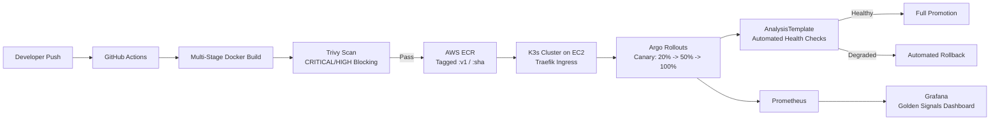

# Sentinel Canary

[](https://github.com/krishjj8/Sentinel-Canary-Go/actions)
[](https://www.terraform.io/)
[](https://k3s.io/)
[](https://argoproj.github.io/argo-rollouts/)
[](LICENSE)

**A cloud-native reference implementation of automated, self-healing progressive delivery — from commit to canary promotion.**

Sentinel Canary demonstrates a complete SRE/Platform Engineering workflow on a minimal, cost-conscious AWS footprint: a Go microservice is built, scanned, and shipped through GitHub Actions into ECR; deployed onto a lightweight K3s cluster; and rolled out via Argo Rollouts using weighted canary steps gated by an automated `AnalysisTemplate`. Prometheus and Grafana provide real-time visibility into traffic split, request rate, and latency throughout the rollout, and a failed analysis run triggers an automatic rollback with no human in the loop.

The project is intentionally scoped to run on a single EC2 instance so the entire stack — infrastructure, cluster, delivery pipeline, and observability — can be provisioned, exercised, and torn down at effectively zero cost.

---

## Table of Contents

- [Architecture & System Flow](#architecture--system-flow)
- [Tech Stack](#tech-stack)
- [Core Architectural Highlights](#core-architectural-highlights)
  - [Progressive Delivery (Canary Rollouts)](#progressive-delivery-canary-rollouts)
  - [Automated Self-Healing Analysis](#automated-self-healing-analysis)
  - [Observability](#observability)
- [Repository Structure](#repository-structure)
- [Screenshots & Validation](#screenshots--validation)
- [Local Replication & Playbook](#local-replication--playbook)
- [Teardown ($0 Cost)](#teardown-0-cost)
- [License](#license)

---

## Architecture & System Flow



**Flow summary:**

1. A push to `main` triggers the GitHub Actions workflow.
2. The Go application is compiled and packaged into a distroless container image via a multi-stage `Dockerfile`.
3. Trivy scans the image; the pipeline fails closed if any `CRITICAL` or `HIGH` severity vulnerability is found.
4. On success, the image is tagged with both a static `:v1` label and the commit SHA, then pushed to a dedicated ECR repository (guarded by a conditional existence check, so the pipeline stays green even when the underlying infrastructure has been torn down).
5. Argo Rollouts picks up the new image tag on the K3s cluster and begins a weighted canary rollout, routed through Traefik.
6. At each step, an `AnalysisTemplate` queries Prometheus for live success-rate and latency signals. A failing analysis run halts the rollout and rolls it back automatically; a passing run advances the weight.
7. Grafana visualizes the rollout in real time, including the traffic split between the stable and canary revisions.

---

## Tech Stack

| Layer | Tool | Function |
|---|---|---|
| **Application** | Go (Golang) | HTTP microservice exposing `/version`, `/health`, `/metrics` |
| **Metrics Instrumentation** | Prometheus Go client library | Exposes application-level counters and histograms for scraping |
| **Containerization** | Docker (multi-stage build) | Compiles the Go binary in a build stage, ships only the binary |
| **Runtime Base Image** | `gcr.io/distroless/static-debian12` | Minimal, shell-less runtime; ~12MB final image, reduced attack surface |
| **Infrastructure as Code** | Terraform | Provisions VPC, subnets, Internet Gateway, Security Groups, ECR, EC2 |
| **Compute** | AWS EC2 | Single-node host for the K3s cluster, with automated 4GB swap allocation |
| **Container Registry** | AWS ECR | Stores versioned and SHA-tagged application images |
| **Orchestration** | K3s | Lightweight, single-binary Kubernetes distribution |
| **Ingress** | Traefik | Routes external port 80 traffic to the active Service |
| **Progressive Delivery** | Argo Rollouts | Manages weighted canary steps and rollback logic |
| **Automated Analysis** | Argo Rollouts `AnalysisTemplate` | Queries Prometheus and gates promotion on live health signals |
| **Metrics Backend** | Prometheus | Scrapes and stores application and rollout metrics |
| **Dashboards** | Grafana | Visualizes Golden Signals: traffic split, request rate, latency |
| **CI/CD** | GitHub Actions | Build, scan, tag, and push pipeline |
| **Security Scanning** | Trivy | Container image vulnerability scanning, blocking on CRITICAL/HIGH |

---

## Core Architectural Highlights

### Progressive Delivery (Canary Rollouts)

Deployments are managed by an Argo Rollouts `Rollout` resource in place of a standard Kubernetes `Deployment`. Instead of shifting 100% of traffic to a new revision immediately, the rollout advances through explicit weighted steps:

```
20% canary traffic → pause for analysis → 50% canary traffic → pause for analysis → 100% promoted
```

Each step is a deliberate checkpoint. Traffic is split at the Service/Ingress layer, so a fraction of real requests hit the new revision while the majority continue to be served by the last known-good version. This bounds the blast radius of a bad deploy to a small percentage of traffic before any human — or automated gate — has to make a call.

### Automated Self-Healing Analysis

Promotion between canary steps is not manual. An `AnalysisTemplate` runs Prometheus queries against the canary revision's live metrics — request success rate and latency — at each pause. If the measured values breach the defined thresholds, Argo Rollouts:

- Halts further weight increases immediately.
- Automatically rolls the `Rollout` back to the last stable revision.
- Requires no operator intervention to prevent a bad deploy from reaching 100% of traffic.

This turns the deployment pipeline into a closed feedback loop: ship → observe → decide, entirely driven by telemetry rather than a fixed timer or a human watching a dashboard.

### Observability

The application exposes Prometheus-compatible metrics via `/metrics`, scraped alongside standard Kubernetes and rollout metadata. Grafana dashboards are built around the SRE Golden Signals:

- **Traffic** — request volume split by application `version` label, showing the canary/stable ratio in real time as a rollout progresses.
- **Rate** — requests per second across both revisions.
- **Latency** — response time distribution per revision, used to catch regressions introduced by the new version.

Because the same Prometheus data backs both the Grafana dashboards and the `AnalysisTemplate`, what an operator sees on screen is exactly what the automated gate is acting on.

---

## Repository Structure

```text
.
├── app/                  # Go HTTP application & multi-stage Dockerfile
├── infra/                # Terraform HCL files for AWS VPC, EC2, ECR & SGs
├── k8s/                  # Kubernetes & Argo Rollouts manifests (Rollout, Analysis, Service, Ingress)
├── monitoring/           # Prometheus and Grafana manifests
├── docs/                 # Architecture diagrams & validation screenshots
│   ├── argo-rollout-status.png
│   └── grafana-traffic-split.png
└── .github/workflows/    # GitHub Actions CI/CD workflow (ci.yml)
```

---

## Screenshots & Validation

### 1. Argo Rollouts — Promoted Canary Status


CLI output of `kubectl argo rollouts get rollout sentinel-app`, showing the rollout fully promoted to `revision:2` (image `v1.0.0-v2`) at 100% weight after the `AnalysisTemplate` passed at each canary step.

### 2. Grafana — Live Traffic Split


Grafana dashboard showing the live PromQL metric curve for `{path="/version", version="1.0.0-v2"}`, confirming that traffic progressively shifted from the stable revision to the canary revision as the rollout advanced.

---

## Local Replication & Playbook

> **Prerequisites:** AWS account with credentials configured (`aws configure`), Terraform >= 1.5, `kubectl`, the `argo rollouts` kubectl plugin, and Docker.

### 1. Clone the repository

```bash
git clone https://github.com/krishjj8/Sentinel-Canary-Go.git
cd Sentinel-Canary-Go
```

### 2. Provision infrastructure with Terraform

```bash
cd infra
terraform init
terraform plan
terraform apply
```

This provisions the VPC, subnets, Internet Gateway, Security Groups, the ECR repository, and a single EC2 instance (with 4GB swap configured automatically) that will host the K3s cluster.

### 3. Retrieve the K3s kubeconfig

```bash
# From the EC2 instance (via SSH or SSM)
sudo cat /etc/rancher/k3s/k3s.yaml

# Locally, point the server field at the EC2 public IP, then:
export KUBECONFIG=~/.kube/sentinel-canary-config
```

### 4. Build and push the application image

```bash
cd ../app
docker build -t <your-ecr-repo-url>:v1 .
docker push <your-ecr-repo-url>:v1
```

> In practice, this step is handled by the `.github/workflows/ci.yml` pipeline on every push to `main`, including the Trivy scan gate.

### 5. Deploy Kubernetes & Argo Rollouts manifests

```bash
cd ../k8s
kubectl apply -f hpa.yaml
kubectl apply -f rollout.yaml
kubectl apply -f analysis-template.yaml
kubectl apply -f service.yaml
kubectl apply -f ingress.yaml
kubectl apply -f deployment.yaml
```

### 6. Deploy the monitoring stack

```bash
cd ../monitoring
kubectl apply -f prometheus.yaml
kubectl apply -f grafana.yaml
kubectl apply -f ingress.yaml
```

### 7. Trigger and observe a canary rollout

```bash
# Push a new image tag to trigger a new revision, then:
kubectl argo rollouts get rollout sentinel-app --watch
```

Watch the weight progress through `20% → 50% → 100%` as the `AnalysisTemplate` evaluates each step against live Prometheus data.

---

## Teardown ($0 Cost)

Everything provisioned by Terraform can be destroyed in a single command, leaving no billable resources behind:

```bash
cd infra
terraform destroy
```

The CI/CD pipeline is designed to remain green even after teardown: the ECR push step in `.github/workflows/ci.yml` conditionally checks whether the repository exists before pushing, so the build/scan stages continue to validate the application without requiring live infrastructure.

---

## License

Released under the [MIT License](LICENSE).
